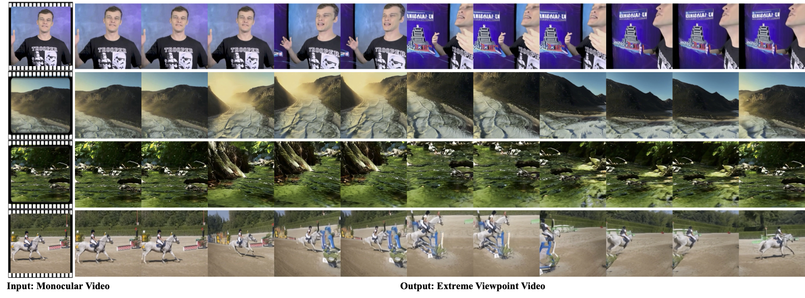
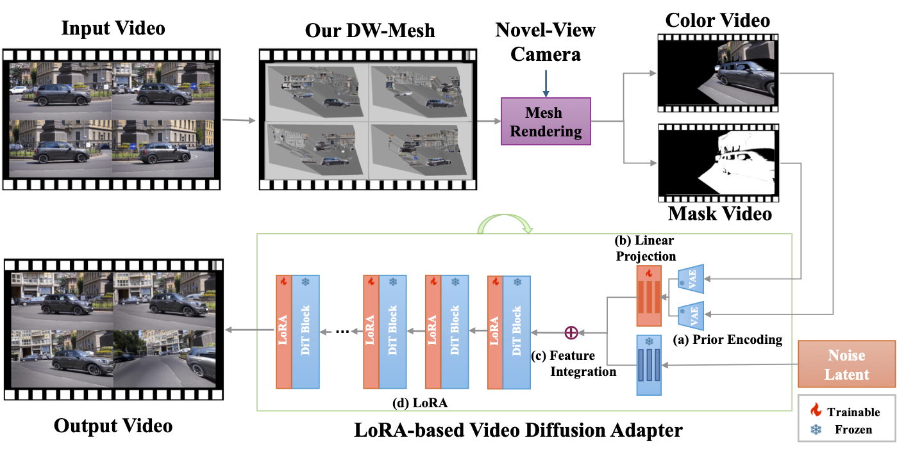

# EX-4D: EXtreme Viewpoint 4D Video Synthesis via Depth Watertight Mesh

<div align="center">


[📄 Paper](https://arxiv.org/abs/2506.05554)  |  [🎥 Homepage](https://tau-yihouxiang.github.io/projects/EX-4D/EX-4D.html)  |  [💻 Code](https://github.com/tau-yihouxiang/EX-4D)

</div>


## 🌟 Highlights

- **🎯 Extreme Viewpoint Synthesis**: Generate high-quality 4D videos with camera movements ranging from -90° to 90°
- **🔧 Depth Watertight Mesh**: Novel geometric representation that models both visible and occluded regions
- **⚡ Lightweight Architecture**: Only 1% trainable parameters (140M) of the 14B video diffusion backbone
- **🎭 No Multi-view Training**: Innovative masking strategy eliminates the need for expensive multi-view datasets
- **🏆 State-of-the-art Performance**: Outperforms existing methods, especially on extreme camera angles

## 🎬 Demo Results

<div align="center">

</div>

*EX-4D transforms monocular videos into camera-controllable 4D experiences with physically consistent results under extreme viewpoints.*

## 🏗️ Framework Overview

<div align="center">

</div>

Our framework consists of three key components:

1. **🔺 Depth Watertight Mesh Construction**: Creates a robust geometric prior that explicitly models both visible and occluded regions
2. **🎭 Simulated Masking Strategy**: Generates effective training data from monocular videos without multi-view datasets
3. **⚙️ Lightweight LoRA Adapter**: Efficiently integrates geometric information with pre-trained video diffusion models

## 🚀 Quick Start

### Installation

```bash
# Clone the repository
git clone https://github.com/tau-yihouxiang/EX-4D.git
cd EX-4D

# Create conda environment
conda create -n ex4d python=3.10
conda activate ex4d
# Install PyTorch (2.x recommended)
pip install torch==2.4.1 torchvision==0.19.1 torchaudio==2.4.1 --index-url https://download.pytorch.org/whl/cu124
# Install Nvdiffrast
pip install git+https://github.com/NVlabs/nvdiffrast.git
# Install dependencies and diffsynth
pip install -e .
```

### Download Pretrained Model
```bash
huggingface-cli download Wan-AI/Wan2.1-I2V-14B-480P --local-dir ./models/Wan-AI
huggingface-cli download yihouxiang/EX-4D --local-dir ./models/EX-4D
```

### Example Usage
#### DW-Mesh Construction
Comming Soon!

#### EX-4D Generation
```
python infer.py --color_video examples/flower/render_180.mp4 --mask_video examples/flower/mask_180.mp4 --output_video outputs/flower.mp4
```

### Example Results

<table>
<tr>
<td align="center">
<video width="100%" controls>
<source src="examples/flower/input.mp4" type="video/mp4">
</video>
<br>
<em>Input Video</em>
</td>
<td align="center" style="font-size: 2em; color: #4A90E2;">
→
</td>
<td align="center">
<video width="100%" controls>
<source src="examples/flower/output.mp4" type="video/mp4">
</video>
<br>
<em>Output Video</em>
</td>
</tr>
</table>

*Note: If videos don't display properly on GitHub, you can view them directly by clicking the file links above.*

<!-- ## 📊 Performance

### Quantitative Results

| Method | FID (Extreme) ↓ | FVD (Extreme) ↓ | VBench Score ↑ |
|--------|-----------------|-----------------|----------------|
| ReCamMaster | 64.68 | 943.45 | 0.434 |
| TrajectoryCrafter | 65.33 | 893.80 | 0.447 |
| TrajectoryAttention | 62.49 | 912.14 | 0.389 |
| **EX-4D (Ours)** | **55.42** | **823.61** | **0.450** | -->

### User Study Results

- **70.7%** of participants preferred EX-4D over baseline methods
- Superior performance in physical consistency and extreme viewpoint quality
- Significant improvement as camera angles become more extreme


## 🎯 Applications

- **🎮 Gaming**: Create immersive 3D game cinematics from 2D footage
- **🎬 Film Production**: Generate novel camera angles for post-production
- **🥽 VR/AR**: Create free-viewpoint video experiences
- **📱 Social Media**: Generate dynamic camera movements for content creation
- **🏢 Architecture**: Visualize spaces from multiple viewpoints

<!-- ## 📈 Benchmarks -->

<!-- ### Viewpoint Range Evaluation

| Range | Small (0°→30°) | Large (0°→60°) | Extreme (0°→90°) | Full (-90°→90°) |
|-------|----------------|----------------|------------------|-----------------|
| FID Score | 44.19 | 50.30 | 55.42 | - |
| Performance Gap | +9.1% better | +8.9% better | +11.3% better | +15.5% better | -->

<!-- *Performance gap compared to the second-best method in each category.* -->

## ⚠️ Limitations

- **Depth Dependency**: Performance relies on monocular depth estimation quality
- **Computational Cost**: Requires significant computation for high-resolution videos
- **Reflective Surfaces**: Challenges with reflective or transparent materials

## 🔮 Future Work
- [ ] Real-time inference optimization (3DGS / 4DGS)
- [ ] Support for higher resolutions (1K, 2K)
- [ ] Neural mesh refinement techniques

## 📚 Citation

If you find our work useful, please consider citing:

```bibtex
@misc{hu2025ex4dextremeviewpoint4d,
      title={EX-4D: EXtreme Viewpoint 4D Video Synthesis via Depth Watertight Mesh}, 
      author={Tao Hu and Haoyang Peng and Xiao Liu and Yuewen Ma},
      year={2025},
      eprint={2506.05554},
      archivePrefix={arXiv},
      primaryClass={cs.CV},
      url={https://arxiv.org/abs/2506.05554}, 
}
```
